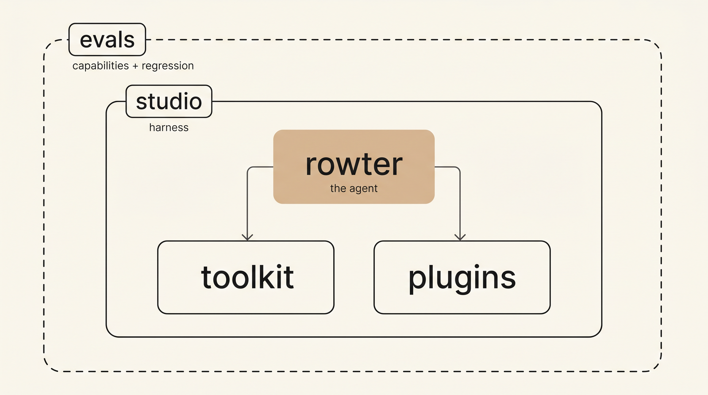

  

**Rowter is an open-source agent for telecom work** — across standards, commercial frameworks, fraud and security, and the systems that sit on top. It grounds answers in cited sources, then reasons past them when they run thin and labels what it couldn't cite. It remembers what you work on, and turns your own files into a living wiki it keeps current. Each data source it draws on is a plugin — a body of documents plus the tools to search it. The plugins it ships with cover the standards bodies (3GPP, O-RAN, CAMARA, GSMA) and a catalog of open-source telecom software, and you can add your own. It runs on your machine; your data stays private.

→ **Start here: [`studio`](https://github.com/rawrter/studio)** — clone, run one command, start chatting. *No API key needed to boot.*

## How it fits together

  

**rowter** is the agent. **studio** is the app you run it in — and the single repo that contains everything: the agent runtime, retrieval layer, plugins, and evals, all with full history.

## The repository

- **[studio](https://github.com/rawrter/studio)** — *everything is here.* The app, the agent (`rowter/`), the retrieval layer (`toolkit/`), the plugin manifests (`plugins/`), and the Inspect-AI evaluation suite (`evals/`). One command to boot.

## Open source

Apache-2.0 licensed. Runs on your machine. Built for the telecom community.
